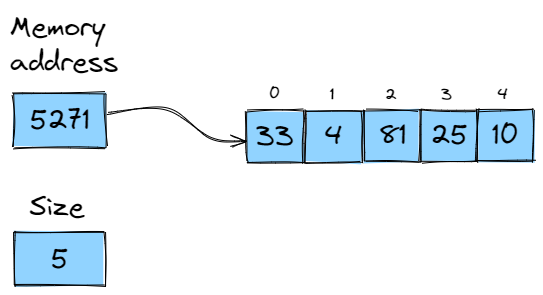
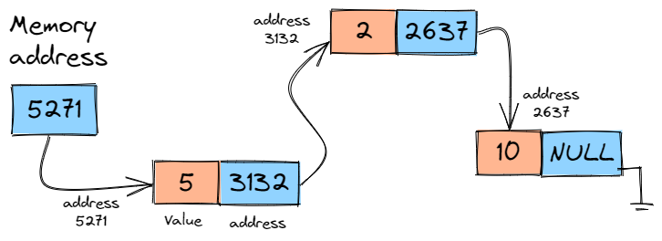
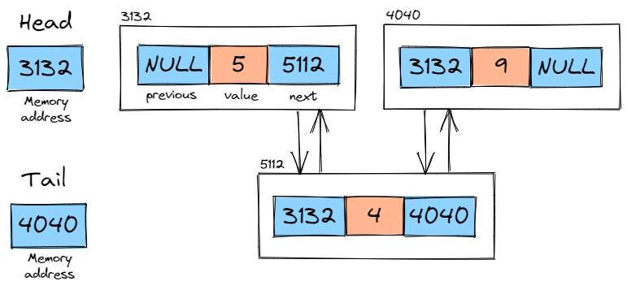

## Lists

Lists are collections of elements of the same type. In general, we can insert elements, update elements, remove elements and check an element in an specific position of a list. Below are some types of lists:

### ArrayList

List implemented with an array.

### LinkedList

List implemented with nodes, each node with 2 memory spaces: one for store the element and another to store the pointer to the next node.

### DoublyLinkedList

Similar to the Linkedlist, it is a list implemented with nodes, each node with 3 memory spaces to store the element, the previous node and the next node.

