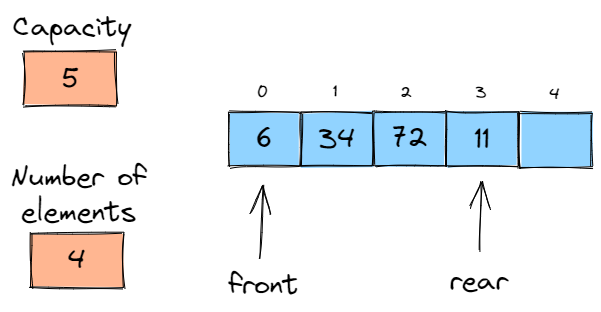
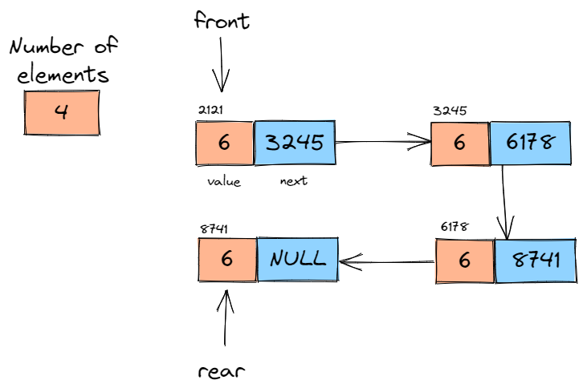

## Queues

Queues are lists of elements with the restriction that insertion must only happen from the back of the queue, and deletion can only be performed from the front of the queue. Thus, the queue is FIFO: first-in-first-out.

### ArrayQueue

Similar to arraylist, however insertions are made in the rear and deletions are made in the front

### LinkedQueue

Similar to linkedlist, however insertions are made in the rear and deletions are made in the front

## How to run

1- Create an account at [repl.it](https://replit.com/)

2- Create a new repl and choose `C` as the programming language

3- Copy and paste the code you want to check, and then click `Run`
