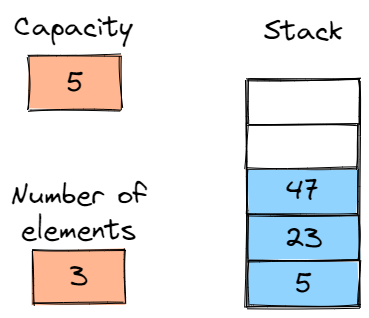
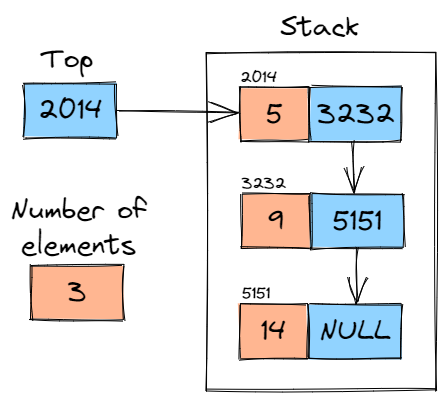

## Stacks

Stacks are lists of elements with the restriction that insertion and removal can only be performed from one place, the top of the stack. Thus, the stack is considered to be of LIFO type: last-in-first-out.

### ArrayStack

Similar to arraylist, however insertions and deletions can only be done at the top of the stack

### LinkedStack

Similar to linkedlist, however insertions and deletions can only be done at the top of the stack

## How to run

1- Create an account at [repl.it](https://replit.com/)

2- Create a new repl and choose `C` as the programming language

3- Copy and paste the code you want to check, and then click `Run`
